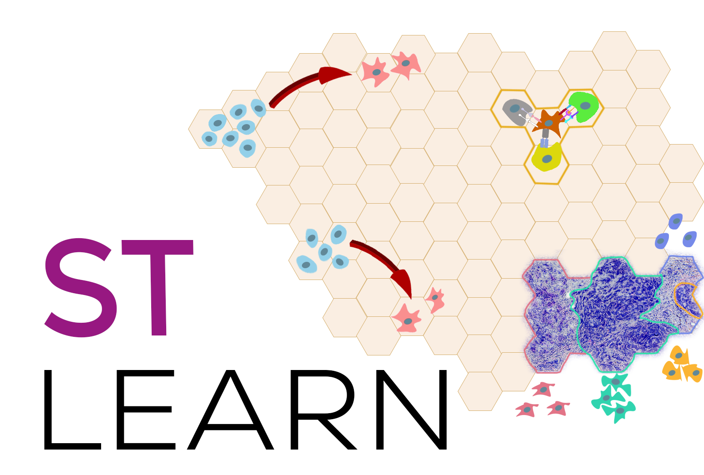

stLearn - A Spatial Transcriptomics Toolkit
============================================================================

|PyPI| |PyPIDownloads| |Docs|

.. |PyPI| image:: https://img.shields.io/pypi/v/stlearn?logo=PyPI
   :target: https://pypi.org/project/stlearn

.. |PyPIDownloads| image:: https://pepy.tech/badge/stlearn

.. |Docs| image:: https://readthedocs.org/projects/stlearn/badge/?version=latest
   :target: https://stlearn.readthedocs.io

stLearn is designed to comprehensively analyse Spatial Transcriptomics (ST)
data to investigate complex biological processes within an undissociated
tissue. ST is emerging as the “next generation” of single-cell RNA sequencing
because it adds spatial and morphological context to the transcriptional
profile of cells in an intact tissue section. However, existing ST analysis
methods typically use the captured spatial and/or morphological data as a
visualisation tool rather than as informative features for model development.
We have developed an analysis method that exploits all three data types:
Spatial distance, tissue Morphology, and gene Expression measurements (SME)
from ST data. This combinatorial approach allows us to more accurately model
underlying tissue biology, and allows researchers to address key questions in
three major research areas: cell type identification, cell trajectory
reconstruction, and the study of cell-cell interactions within an
undissociated tissue sample.

Latest Additions
----------------

.. include:: release_notes/1.2.1.rst

.. include:: release_notes/1.1.5.rst

.. include:: release_notes/1.1.1.rst

.. include:: release_notes/0.4.6.rst

.. include:: release_notes/0.3.2.rst

.. toctree::
   :maxdepth: 1
   :hidden:

   installation
   api
   tutorials
   interactive
   release_notes/index
   authors
   references
